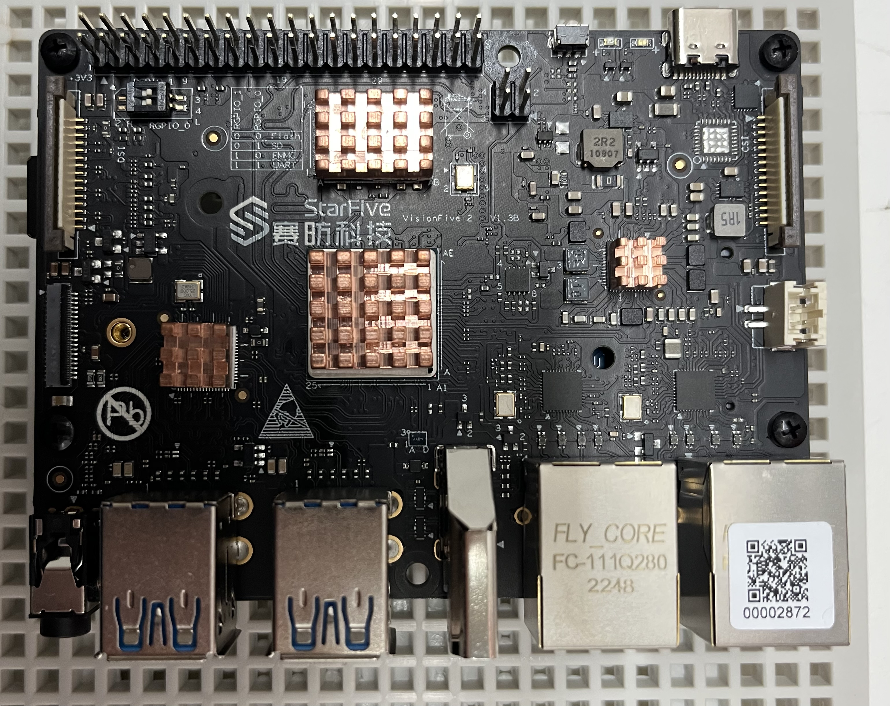
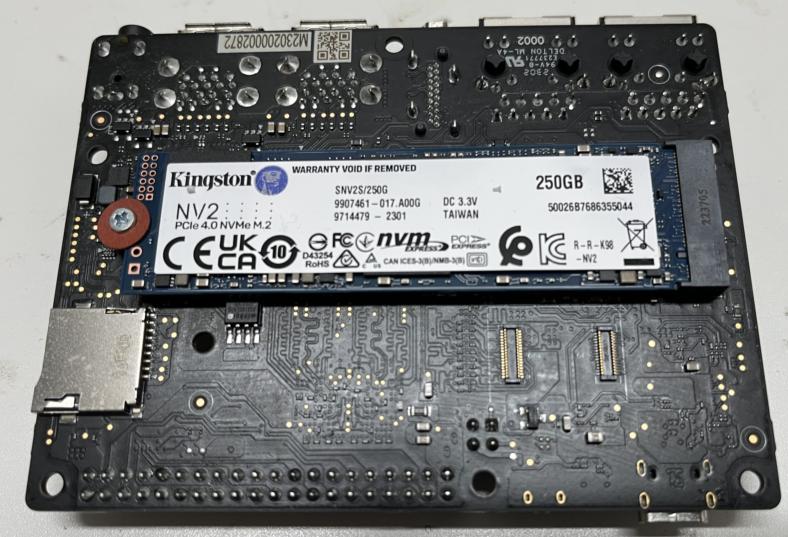
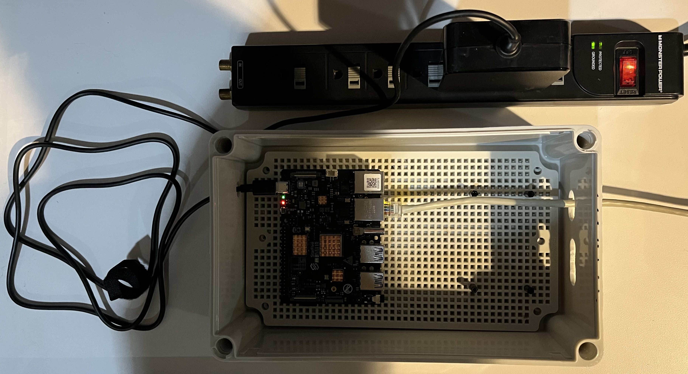

# VisionFive2

My journey with the VisionFive 2 open source quad-core RISC-V dev board

# Bill of Materials

[VisionFive 2 open source quad-core RISC-V dev board](https://www.kickstarter.com/projects/starfive/visionfive-2)

[Geekworm Raspberry Pi Heatsink CPU Cooler 8PCS Copper Heatsinks with Thermal Conductive Adhesive](https://www.amazon.com/dp/B0B2CP1G23) 
(optional but highly recommended and these fit well)

[SanDisk 64GB Extreme microSDXC UHS-I Memory Card](https://www.amazon.com/dp/B09X7C7LL1) (you can pick a size to suit your application, 
but this size worked for me and was reasonably priced)

[M2.5 Black Nylon Screw, Nut and Standoff Set](https://www.amazon.com/dp/B07XJWF7HM) (I opted for nylon vs metal just to be safe, 
but you can use metal if you're comfortable with that)

[QILIPSU Junction Box with Mounting Plate 250x150x100mm, Clear Cover Plastic DIY Electrical Project Case IP67](https://www.amazon.com/dp/B07H5B9W5H) 
(or pick a box more appropriate for your setup)

[65W/61W USB C Power Adapter, WEGWANG Type C Power Delivery PD Wall Charger 65W](https://www.amazon.com/dp/B07KXGXBL6) 
(or equivalent)

[WEme CF Card Reader, Aluminum SuperSpeed Micro SD Card Converter with OTG Adapter for SanDisk CF TF SDHC SDXC MMC Card, USB 3.0 SD Card Reader Writer](https://www.amazon.com/dp/B06Y4BW487) 
(or equivalent)

[Kingston NV2 250G M.2 2280 NVMe Internal SSD](https://www.amazon.com/dp/B0BBWH7DBT) (optional, pick size to suit your application)

# The Board


Vision Five 2 with heatsinks

 
Vision Five 2 with SSD installed

# Initial Setup

Mount the VisionFive 2 card in the proto box using the nylon standoffs. Drill holes in the proto box to allow for wires.

## Flash SD Card

Initially use the `55` StarFive Debian OS image: [starfive-jh7110-VF2-VF2_515_v2.3.0-55.img.bz2](https://drive.google.com/file/d/14RDGjyUkyUKsowP7zH8E55Ym6FpuE899) .

Use [Win32DiskImager](https://sourceforge.net/projects/win32diskimager/) to flash the above Debian OS image to the SD card.
(The Balena Etcher did not work for me)

## Hardware connections

- Connect an ethernet cable to one of the board's ethernet connectors.
- Connect power to the USB-C connector.

Tip: use a power strip with an on/off switch to control power to the board. It doesn't have its own power switch.



## Access via your local network

The board will appear on your network as `starfive`. Use [PuTTY](https://www.putty.org/) or similar to login to the board.

Note: you don't need to use the "serial port".

Also, the HDMI and mouse/keyboard don't work at this point.

## Login

Initial login:

```
Username: user
Password: starfive
```

Note that `root` login may not work yet. [Follow these directions to enable root](https://doc-en.rvspace.org/VisionFive2/Quick_Start_Guide/VisionFive2_QSG/enable_ssh_root_login.html).

After root is enabled, you can now also login as root:

```
Username: root
Password: starfive
```

## Python

First, [Install Python](https://cloudinfrastructureservices.co.uk/how-to-install-python-3-in-debian-11-10/) .

Then enable venvs: `apt install python3.10-venv`

## Using the SSD

If you installed the SSD (recommended), perform the steps given at [StarFive VisionFive 2 Official Debian SSD Boot Guide](https://jamesachambers.com/starfive-visionfive-2-debian-ssd-boot-guide/) 
to enable it.

# References

## Websites

[StarFive VisionFive 2 High Performance RISC-V SBC Review by James Chambers](https://jamesachambers.com/starfive-visionfive2-review/)

## OSs

[Debian OS images](https://drive.google.com/drive/folders/1yhMVrB05wSjcqbrxgW2nXJNOeSC3ViRx)

[Main Debian StarFive page](https://debian.starfivetech.com/)
